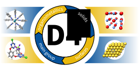
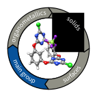
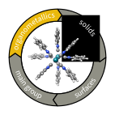
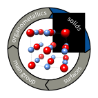
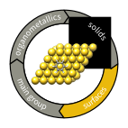

# Artwork created for DFT-D4

This repository contains artwork created in the context of DFT-D4.

## DFT-D4 label for the ASE webpage

## The D4 circle

To provide a short graphical overview over the capabilities of D4, this circle was created.

Additional focus on the different fields of the circle

   

There seems to be a happy coincidence with the eigth album of the band
Five Finger Death Punch, both in the naming and general style of the graphic.
Therefore, we use the opportunity to include a reference to their
[album F8](https://5fdp.ffm.to/f8album) here :metal:.

## License

 The work in this repository is licensed under a <a rel="license" href="http://creativecommons.org/licenses/by-sa/4.0/">Creative Commons Attribution-ShareAlike 4.0 International License</a>.
